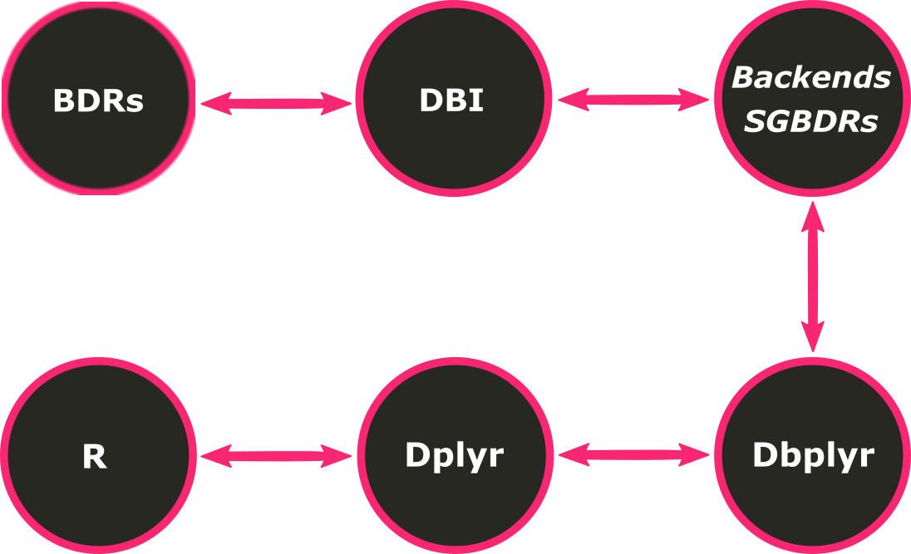
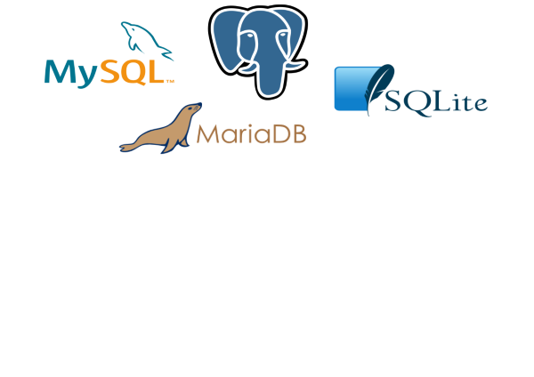

```{r setup, include=FALSE}
options(htmltools.dir.version = FALSE)
```

class: inverse, center, middle
# Motivação

---
# O Problema

- Bancos de Dados Relacionais [(BDRs)]() são [limitados]() no que diz respeito
à [programação estatística]()
  
  - Moda, percentil, modelagem e cálculos estatísticos mais sofisicados são 
  [tarefas difíceis para]() Sistemas Gerenciadores de Bancos de Dados
  Relacionais [(SGBDRs)]()
  
    >*While basic aggregation operations (SUM, AVG) are part of SQL, there is 
    no support for other commonly used operations like variance and covariance.
    Such computations, as well as more advanced ones like regression and 
    principal component analysis, are usually performed using statistical 
    packages and libraries.*
                                        (Srivastava & Ngo, 2014)

```{r, echo=FALSE, fig.align = "center", tidy.opts = list(blank = FALSE)}
knitr::include_graphics("figures/logos_bds_relac2.png")
```

---
# O Problema
  
- [Ferramentas estatísticas]() nem sempre são viáveis com [muitos dados]()
  
  - O que cabe em disco [não]() necessariamente [cabe na memória]()
  
  - Se os dados [já estão em um BD](), por que trazê-los para memória?
  
    >*If your data fits in memory there is no advantage to putting it in a 
    database: it will only be slower and more frustrating.*
                                                (Wickham, 2019)
                                          
```{r, echo = FALSE, fig.align = "center", tidy.opts = list(blank = FALSE)}

```

---
class: inverse, center, middle
# Soluções

---
# Solução 1

[Implementação]() da ferramenta estatística [dentro dos SGBDRs]()

- [Limitações]()

  - Nem todo SGBDR apresenta essa [funcionalidade]() (Postgres, p. ex.)

  - Vendedores dos SGBDRs precisam implementar a funcionalidade (o que pode
  custar [caro]() e/ou [demorar]() para ser feito)

  - [Dificilmente]() a implementação será [*open source*]()

```sql
-- calculate simple quantiles
EXEC sp_execute_external_script
  @language = N'R'
  ,@script = N'
*    res <- quantile(InputDataSet$Ages);
    print(res);'
  ,@input_data_1 = N'
    SELECT Ages = DATEDIFF(YEAR,[BirthDate],GETDATE())
    FROM [AdventureWorksDW2014].[dbo].[DimCustomer];';
```

---
# Solução 2

[Conexão]() do software estatístico [aos SGBDRs]()

- Por que usar o [**R**]() como [software]() e principal [linguagem
estatística]()?

   - Linguagem estatística mais [amplamente adotada]()
   
   - [*Open source*]()
   
   - [Comunidade ativa]()
   
```{r, echo = FALSE, fig.align = "center", tidy.opts = list(blank = FALSE)}
knitr::include_graphics("figures/logo_r2.png")
```

```{r, eval = FALSE}
con_postgres <- RPostgres::dbConnect(
  RPostgres::Postgres(),
  dbname = "my_database",
  host = "localhost", port = 54320,
  user = "postgres", pwd
)
```

---
class: inverse, center, middle
# Dbplyr

---
class: inverse
# Diagrama

```{r, echo = FALSE, fig.align = "center"}

```

---
# BDRs

[Qualquer SGBDR]() pode ser suportado [desde que um *backend* seja criado]()

  - Aproveita-se do fato de que todo SGBDR tem suporte para conexões externas


```{r, echo = FALSE, fig.align = "center"}

```


---
# DBI

É uma biblioteca que fornece uma [interface]() consistente para comunicação
entre R e SGDBRs
  
  - Permite que o R envie comandos para os bancos de dados, 
  [independentemente do SGBDR utilizado]()
  
  - [Padronização das funções]() possibilita a construção de pacotes genéricos
  para lidar com os dados de uma conexão, facilitando:
  
    - A criação e implementação dos pacotes (necessidade de menos decisões
    arbitrárias) 
    
    - A manipulação dos usuários (padrão familiar)
  
  - [Fornece uma especificação de interface]() que permite qualquer um criar
  novos *backends* para um BDR
  
---
# *Backends* dos SGBDRs

[Bibliotecas específicas]() que permitem a conexão entre o R e SGBDRs
  
  - Permite o envio de *queries* e recebimento de dados do BDR
  
  - Permite ao [`dplyr`]() trabalhar com [múltiplas fontes de dados usando o]()
  [mesmo código]()
    
  - Funções de leitura (`dbReadTable`) e escrita (`dbWriteTable`) de tabelas
  através de uma conexão
  
  - Exemplos:
    - [`RPostgres`]()  
    - [`RSQLite`]()
    - [`RMariaDB`]() 
    - [`bigrquery`]()
    
---
# BDRs, DBI, *Backends* dos SGBDRs

Os argumentos para [`DBI::dbConnect()`]() variam de BDR para BDR, mas o
[primeiro argumento é sempre o *backend*]() do BDR:

  - [`RSQLite::SQLite()`]() para `RSQLite`
  - [`RPostgreSQL::PostgreSQL()`]() para `RPostgreSQL`
  - [`RMySQL::MySQL()`]() para `RMySQL` (abandonado)
  - [`RMariaDB::MariaDB()`]() para `RMariaDB`*
  - [`bigrquery::bigquery()`]() para `BigQuery`
  
######*Funciona de backend para MariaDB e MySQL; substituiu o pacote `RMySQL`

`SQLite` precisa de outro argumento: o caminho para o BDR. Porém, a [maioria
dos BDRs]() não [está]() em um arquivo, mas sim [em outro servidor](). Isso faz
com que, na prática, o [código seja semelhante a]():

```r
con <- RPostgres::dbConnect(
  RPostgres::Postgres(), dbname = "alunos",
  host = "database.ime.com", port = 54320,
  user = "professorMAC5861"
  password = rstudioapi::askForPassword("database_password")
)
```

---
# Dbplyr

Pacote do R para [tradução de código `dplyr` em código SQL]() e [tradução da]()
[resposta do BDR em um *R data frame*]()  

  - [De forma automática](), consegue gerar um código em SQL a partir de um
  código em R
  
  - Capaz de transformar verbos do pacote do R `dplyr` em *queries* SQL
  completas (atua, portanto, como *backend* do `dplyr`)
  
  - Permite [receber resultados parciais dos SGBDRs]() e traduzí-los
  em uma resposta interpretável pelo R
  
  - Não consegue traduzir qualquer código, mas ajuda bastante

```r
dbplyr::translate_sql(x ^ 2L)
#> <SQL> POWER(`x`, 2)

dbplyr::translate_sql(log(x, 10))
#> <SQL> LOG(10.0, `x`)
```

---
# Dplyr

Pacote do R com gramática para [manipulação de dados]()

  - Fornece um [conjunto consistente de verbos]() que ajudam a resolver os
  desafios mais comuns de manipulação de dados

  - [Transformação sintática]() sobre tabelas
  
  - [*Pipelines*](), o que permite que cada linha delimite uma ação, como se
  fosse uma receita de bolo
  
  - [Operadores infixos](), o que permite que se saiba exatamente a ordem das
  operações
  
  - [Metaprogramação](), o que garante um código mais limpo
  
  - [*Quasi-quotations*](), o que garante a escrita de funções confiáveis que
  reduzem a redundância no código
  
  - [Uma das bibliotecas mais utilizadas](), graças às vantagens mencionadas

---
class: inverse, center, middle
# Exemplos

---
# Dplyr

```r
cnes %>%
  select(def_atividad, def_turno_at, starts_with("mun_")) %>%
  filter(def_atividad == "Unidade SEM atividade de Ensino") %>%
  mutate(
    so_um_turno = ifelse(grepl("SOMENTE", def_turno_at), 1, 0),
    localizacao = ifelse(mun_CAPITAL == "S", "CAPITAL", "INTERIOR")
  ) %>%
  group_by(localizacao) %>%
  summarise(f_so_um_turno = sum(so_um_turno)*100/n())
  
#> # A tibble: 2 x 2
#>   localizacao f_so_um_turno
#>   <chr>               <dbl>
#> 1 CAPITAL              1.10
#> 2 INTERIOR             1.80
```

---
# Dplyr + Dbplyr

O processo é [*lazy*](), nunca puxa [dados para o R](), a menos que você os
[solicite]() [explicitamente]() com [`dplyr::collect()`]().

```r
*tbl(con, "cnes") %>%
  select(def_atividad, def_turno_at, starts_with("mun_")) %>%
  filter(def_atividad == "Unidade SEM atividade de Ensino") %>%
  mutate(
    so_um_turno = ifelse(grepl("SOMENTE", def_turno_at), 1, 0),
    localizacao = ifelse(mun_CAPITAL == "S", "CAPITAL", "INTERIOR")
  ) %>%
  group_by(localizacao) %>%
  summarise(f_so_um_turno = sum(so_um_turno)*100/n()) %>%
* collect()

#> # A tibble: 2 x 2
#>   localizacao f_so_um_turno
#>   <chr>               <dbl>
#> 1 CAPITAL              1.10
#> 2 INTERIOR             1.80
```

---
# Tradução

[`dplyr::show_query()`]()

[`dplyr::explain()`]()

```sql
SELECT "localizacao", SUM("so_um_turno") * 100.0 / COUNT(*) AS "f_so_um_turno"
FROM (SELECT "def_atividad", "def_turno_at", "mun_MUNNOME", "mun_MUNNOMEX", "mun_AMAZONIA", "mun_FRONTEIRA", "mun_CAPITAL", "mun_MSAUDCOD", "mun_RSAUDCOD", "mun_CSAUDCOD", "mun_LATITUDE", "mun_LONGITUDE", "mun_ALTITUDE", "mun_AREA", "mun_codigo_adotado", "mun_coordenadas", CASE WHEN ("def_turno_at" like 'SOMENTE') THEN (1.0) WHEN NOT("def_turno_at" like 'SOMENTE') THEN (0.0) END AS "so_um_turno", CASE WHEN ("mun_CAPITAL" = 'S') THEN ('CAPITAL') WHEN NOT("mun_CAPITAL" = 'S') THEN ('INTERIOR') END AS "localizacao"
FROM (SELECT *
FROM (SELECT "def_atividad", "def_turno_at", "mun_MUNNOME", "mun_MUNNOMEX", "mun_AMAZONIA", "mun_FRONTEIRA", "mun_CAPITAL", "mun_MSAUDCOD", "mun_RSAUDCOD", "mun_CSAUDCOD", "mun_LATITUDE", "mun_LONGITUDE", "mun_ALTITUDE", "mun_AREA", "mun_codigo_adotado", "mun_coordenadas"
FROM "cnes") "dbplyr_1033"
WHERE ("def_atividad" = 'Unidade SEM atividade de Ensino')) "dbplyr_1034") "dbplyr_1035"
GROUP BY "localizacao"
```

```sql
HashAggregate  (cost=4091.28..4091.33 rows=2 width=64)
  Group Key: CASE WHEN (cnes."mun_CAPITAL" = 'S'::text) THEN 'CAPITAL'::text WHEN (cnes."mun_CAPITAL" <> 'S'::text) THEN 'INTERIOR'::text ELSE NULL::text END
  ->  Seq Scan on cnes  (cost=0.00..3810.18 rows=22488 width=77)
        Filter: (def_atividad = 'Unidade SEM atividade de Ensino'::text)
```

---

# Desempenho

[`microbenchmark::microbenchmark()`]()

```r
# Unit: milliseconds
#                 expr        min     median        max
#              turno()   25.87095   25.92416   126.6529
#  turno(con_postgres)  151.11062  153.43344  178.16157
#    turno(con_sqlite)   75.66695   76.58116   83.03558
#     turno(con_mysql)  188.36329  191.83665  200.08846
#     turno(con_maria)  172.39715  181.23544  188.76618
#        turno(con_bq) 4231.28270 4247.64543 4975.46140
```

---

# Referências

[Srivastava & Ngo, 2014](https://www.researchgate.net/publication/228710145_Statistical_Databases)

[Wickham, 2019](https://dbplyr.tidyverse.org/articles/dbplyr.html)

[Databases](https://web.archive.org/web/20161121000310/http://cran.r-project.org:80/web/packages/dplyr/vignettes/databases.html)

[Executing R code in SQL Server](https://www.mssqltips.com/sqlservertip/4126/sql-server-2016-r-services-executing-r-code-in-sql-server/)

[R, Databases & SQL](https://rdbsql.rsquaredacademy.com/dbplyr.html)

[SQL databases and R](https://datacarpentry.org/R-ecology-lesson/05-r-and-databases.html)

[Write advanced R functions with SQL Server Machine Learning Services](https://docs.microsoft.com/en-us/sql/advanced-analytics/tutorials/quickstart-r-functions?view=sql-server-ver15)

[R and Data – When Should we Use Relational Databases?](https://cran.r-project.org/web/packages/dbplyr/dbplyr.pdf)

[Database Queries With R](https://db.rstudio.com/getting-started/database-queries/)

[nodbi: the NoSQL Database Connector](https://www.r-bloggers.com/nodbi-the-nosql-database-connector/)

[Advanced R](https://adv-r.hadley.nz/quasiquotation.html)

---
# Referências

[Implementing a new backend: DBI](https://dbi.r-dbi.org/articles/backend)

[DBI](https://dbi.r-dbi.org/)

[Database basics - dplyr and DBI](https://shiny.rstudio.com/articles/overview.html)

[Introduction to dbplyr](https://dbplyr.tidyverse.org/articles/dbplyr.html)

[Function translation](https://dbplyr.tidyverse.org/articles/translation-function.html)

[Verb translation](https://dbplyr.tidyverse.org/articles/translation-verb.html)

[Databases using dplyr](https://db.rstudio.com/dplyr/)

[Introduction to dplyr](https://dplyr.tidyverse.org/articles/dplyr.html)

[Programming with dplyr](https://dplyr.tidyverse.org/articles/programming.html)

[PostgreSQL 12.0 Documentation](https://www.postgresql.org/docs/12/index.html)

[RMariaDB](https://rmariadb.r-dbi.org/)

---
class: inverse, center, middle
# Obrigada(o)!

```{r image_grobs, fig.show = "hold", echo = FALSE, fig.align = "default", out.width="10%"}
knitr::include_graphics("figures/emo_smilling_eyes.png")

```

