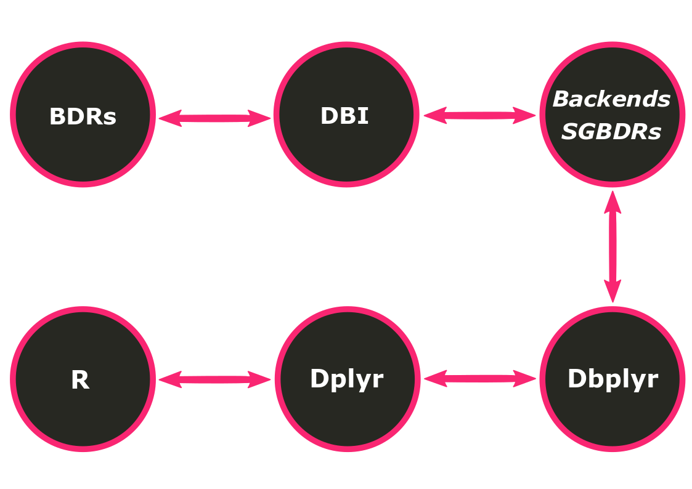

```{r setup, include=FALSE}
options(htmltools.dir.version = FALSE)
```

class: inverse, center, middle
# Motivação

---
# O Problema

- Bancos de dados [(BDs) relacionais]() são [limitados]() no que diz respeito à
[programação estatística]()
  
  - Moda, percentil, modelagem e cálculos estatísticos são [tarefas difíceis]() 
  [para]() Sistemas Gerenciadores de Bancos de Dados [(SGBDs)]().
  
    >*While basic aggregation operations (SUM, AVG) are part of SQL, there is 
    no support for other commonly used operations like variance and co-variance.
    Such computations, as well as more advanced ones like regression and 
    principal component analysis, are usually performed using statistical 
    packages and libraries.*
                                    (Srivastava & Ngo, 2014)

```{r, echo=FALSE, fig.align = "center", tidy.opts = list(blank = FALSE)}

```

---
# O Problema
  
- [Ferramentas estatísticas]() nem sempre são viáveis com [muitos dados]()
  
  - O que cabe em disco [não]() necessariamente [cabe na memória]()
  
  - Se os dados [já estão em um BD](), por que trazê-los para memória?
  
    >*If your data fits in memory there is no advantage to putting it in a 
    database: it will only be slower and more frustrating.*
                                    (Wickham, 2019)
                                          
```{r, echo = FALSE, fig.align = "center", tidy.opts = list(blank = FALSE)}

```

---
class: inverse, center, middle
# Soluções

---
# Solução 1

[Implementação]() da ferramenta estatística [dentro dos SGBDs relacionais]()

- [Limitações]()

  - Nem todo SGBD apresenta essa [funcionalidade]() (Postgres, p. ex.)

  - Vendedores dos SGBDs precisam implementar a funcionalidade (o que pode
  custar [caro]() e/ou [demorar]() para ser feito)

  - [Dificilmente]() a implementação será [*open source*]()

```sql
-- calculate simple quantiles
EXEC sp_execute_external_script
  @language = N'R'
  ,@script = N'
    res <- quantile(InputDataSet$Ages);
    print(res);'
  ,@input_data_1 = N'
    SELECT Ages = DATEDIFF(YEAR,[BirthDate],GETDATE())
    FROM [AdventureWorksDW2014].[dbo].[DimCustomer];';
```
```{r, eval = FALSE, include = FALSE}
#calculate simple quantiles
stats::quantile(InputDataSet$Ages)
```

---
# Solução 2

[Conexão]() do software estatístico [aos SGBDs relacionais]()

- Por que usar o [**R**]() como principal [linguagem estatística]()?

   - Linguagem estatística mais [amplamente adotada]()
   
   - [*Open source*]()
   
   - [Comunidade ativa]()
   
```{r, echo = FALSE, fig.align = "right", tidy.opts = list(blank = FALSE)}
knitr::include_graphics("figures/logo_r2.png")
```

```{r, eval = FALSE}
con_postgres <- RPostgres::dbConnect(
  RPostgres::Postgres(),
  dbname = "my_database",
  host = "localhost", port = 54320,
  user = "postgres", pwd
)
```

---
class: inverse, center, middle
# Dbplyr

---
# Diagrama

```{r, echo = FALSE, fig.align = "center"}

```

---
# BDs

[Qualquer SGBD]() pode ser suportado [desde que um *backend* seja criado]()

  - Aproveita-se do fato de que todo SGBD tem suporte para conexões externas


```{r, echo = FALSE, fig.align = "center"}
knitr::include_graphics("figures/logos_bds_relac2.png")
```


---
# DBI

[Interface de BDs]() consistente para comunicação entre R e SGDBs
  
  - Permite que o R envie comandos para os bancos de dados, 
  [independentemente do SGBD utilizado]()
  
  - [Padronização das funções]() possibilita a construção de pacotes genéricos
  para lidar com os dados de uma conexão, facilitando:
    - A criação e implementação dos pacotes (necessidade de menos decisões
    arbitrárias) 
    - A manipulação dos usuários (padrão familiar)
  
  - [Fornece uma especificação de interface]() que permite qualquer um criar
  novos *backends* para um BD
  
---
# *Backends* dos SGBDs relacionais

[Bibliotecas específicas]() que permitem a conexão entre o R e SGBDs relacionais
  
  - Permite o envio de *queries* e recebimento de dados do BD
  
  - Permite ao [`dplyr`]() trabalhar com [múltiplas fontes de dados usando o]() [mesmo código]()
    
  - Funções de leitura (`dbReadTable`) e escrita (`dbWriteTable`) de tabelas
  através de uma conexão
  
  - Exemplos:
    - [`RMariaDB`]() 
    - [`RPostgres`]()  
    - [`RSQLite`]()
    - [`bigrquery`]()
    
---
# BD, DBI, *Backends* dos SGBDs relacionais

Os argumentos para [`DBI :: dbConnect ()`]() variam de BD para BD, mas o [primeiro argumento é sempre o *backend*]() do BD:

  - [`RSQLite :: SQLite ()`]() para `RSQLite`
  - [`RMySQL :: MySQL ()`]() para `RMySQL`
  - [`RPostgreSQL :: PostgreSQL ()`]() para `RPostgreSQL`
  - [`bigrquery :: bigquery ()`]() para `BigQuery`
  - [`odbc :: odbc ()`]() para `odbc`

`SQLite` precisa de outro argumento: o caminho para o banco de dados. Porém, a [maioria dos BDs]() não [está]() em um arquivo, mas sim [em outro servidor](). Isso faz com que, na prática, o [código seja semelhante a]():

```{r, eval = FALSE}
con <- DBI::dbConnect(
  RMySQL::MySQL(),
  host = "database.ime.com",
  user = "fernanda_fortti",
  password = rstudioapi::askForPassword("database_password")
)
```

---
# Dbplyr

Pacote do R para [tradução de código `dplyr` em código SQL]() e [tradução da]()
[resposta do banco de dados em um *R data frame*]()  

  - [De forma automática](), consegue gerar um código em SQL a partir de um
  código em R
  
  - Capaz de transformar verbos do pacote do R `dplyr` em *queries* SQL
  completas (atua, portanto, como *backend* do `dplyr`)
  
  - Permite [receber resultados parciais dos SGBDs relacionais]() e traduzí-los
  em uma resposta interpretável pelo R
  
  - Não consegue traduzir qualquer código, mas ajuda bastante

```{r, eval = FALSE}
dbplyr::translate_sql(x ^ 2L)
#> <SQL> POWER(`x`, 2)

dbplyr::translate_sql(log(x, 10))
#> <SQL> LOG(10.0, `x`)
```

---
# Dplyr

Pacote do R com gramática para [manipulação de dados]()

  - Fornece um [conjunto consistente de verbos]() que ajudam a resolver os
  desafios
  mais comuns de manipulação de dados

  - [Transformação sintática]() sobre tabelas
  
  - [*Pipelines*](), o que permite que cada linha delimite uma ação, como se
  fosse uma receita de bolo
  
  - [Operadores infixos](), o que permite que se saiba exatamente a ordem das
  operações
  
  - [Metaprogramação](), o que garante um código mais limpo
  
  - [*Quasi-quotations*](), o que garante a escrita de funções confiáveis que
  reduzem a duplicação/duplicidade no código
  
  - [Pacote do R mais famoso e mais utilizado](), graças às vantagens
  mencionadas

---
# Dplyr

Operações [*lazy*]()

  - [Ao trabalhar com bancos de dados](), o `dplyr` tenta ser o mais preguiçoso
  possível
  
  - Atrasa a execução de qualquer trabalho até o último momento possível: 
  reúne tudo o que você deseja fazer e [envia ao BD em uma única etapa]().
  
  - Nunca puxa [dados para o R](), a menos que você os [solicite]()
  [explicitamente]() (`print()`, `collect()`).

---
class: inverse, center, middle
# Exemplos

---
# Dplyr

```r
cnes %>%
  select(def_atividad, def_turno_at, starts_with("mun_")) %>%
  filter(def_atividad == "Unidade SEM atividade de Ensino") %>%
  mutate(
    so_um_turno = ifelse(grepl("SOMENTE", def_turno_at), 1, 0),
    localizacao = ifelse(mun_CAPITAL == "S", "CAPITAL", "INTERIOR")
  ) %>%
  group_by(localizacao) %>%
  summarise(f_so_um_turno = sum(so_um_turno)*100/n())
  
#> # A tibble: 2 x 2
#>   localizacao f_so_um_turno
#>   <chr>               <dbl>
#> 1 CAPITAL              1.10
#> 2 INTERIOR             1.80
```

---
# Dplyr + Dbplyr

[`dplyr::tbl ()`]()

[`dplyr::collect ()`]()

```r
* tbl(con, "cnes") %>%
  select(def_atividad, def_turno_at, starts_with("mun_")) %>%
  filter(def_atividad == "Unidade SEM atividade de Ensino") %>%
  mutate(
    so_um_turno = ifelse(grepl("SOMENTE", def_turno_at), 1, 0),
    localizacao = ifelse(mun_CAPITAL == "S", "CAPITAL", "INTERIOR")
  ) %>%
  group_by(localizacao) %>%
  summarise(f_so_um_turno = sum(so_um_turno)*100/n()) %>%
* collect()

#> # A tibble: 2 x 2
#>   localizacao f_so_um_turno
#>   <chr>               <dbl>
#> 1 CAPITAL              1.10
#> 2 INTERIOR             1.80
```

---
# Tradução

[`dplyr::show_query ()`]()

[`dplyr::explain ()`]()

```sql
SELECT "localizacao", SUM("so_um_turno") * 100.0 / COUNT(*) AS "f_so_um_turno"
FROM (SELECT "def_atividad", "def_turno_at", "mun_MUNNOME", "mun_MUNNOMEX", "mun_AMAZONIA", "mun_FRONTEIRA", "mun_CAPITAL", "mun_MSAUDCOD", "mun_RSAUDCOD", "mun_CSAUDCOD", "mun_LATITUDE", "mun_LONGITUDE", "mun_ALTITUDE", "mun_AREA", "mun_codigo_adotado", "mun_coordenadas", CASE WHEN ("def_turno_at" like 'SOMENTE') THEN (1.0) WHEN NOT("def_turno_at" like 'SOMENTE') THEN (0.0) END AS "so_um_turno", CASE WHEN ("mun_CAPITAL" = 'S') THEN ('CAPITAL') WHEN NOT("mun_CAPITAL" = 'S') THEN ('INTERIOR') END AS "localizacao"
FROM (SELECT *
FROM (SELECT "def_atividad", "def_turno_at", "mun_MUNNOME", "mun_MUNNOMEX", "mun_AMAZONIA", "mun_FRONTEIRA", "mun_CAPITAL", "mun_MSAUDCOD", "mun_RSAUDCOD", "mun_CSAUDCOD", "mun_LATITUDE", "mun_LONGITUDE", "mun_ALTITUDE", "mun_AREA", "mun_codigo_adotado", "mun_coordenadas"
FROM "cnes") "dbplyr_1033"
WHERE ("def_atividad" = 'Unidade SEM atividade de Ensino')) "dbplyr_1034") "dbplyr_1035"
GROUP BY "localizacao"
```

```sql
HashAggregate  (cost=4091.28..4091.33 rows=2 width=64)
  Group Key: CASE WHEN (cnes."mun_CAPITAL" = 'S'::text) THEN 'CAPITAL'::text WHEN (cnes."mun_CAPITAL" <> 'S'::text) THEN 'INTERIOR'::text ELSE NULL::text END
  ->  Seq Scan on cnes  (cost=0.00..3810.18 rows=22488 width=77)
        Filter: (def_atividad = 'Unidade SEM atividade de Ensino'::text)
```

---

# Desempenho?


---
# Referências


---
class: inverse, center, middle
# Obrigado(a)!

```{r image_grobs, fig.show = "hold", echo = FALSE, fig.align = "default", out.width="10%"}

knitr::include_graphics("figures/nerd_face.png")
```

